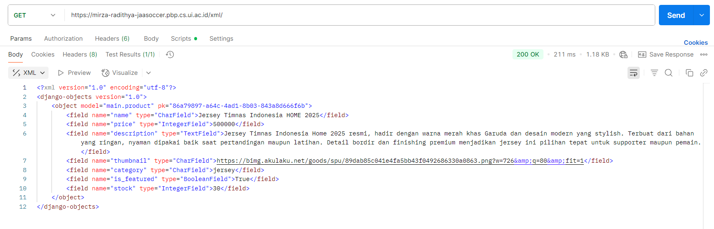
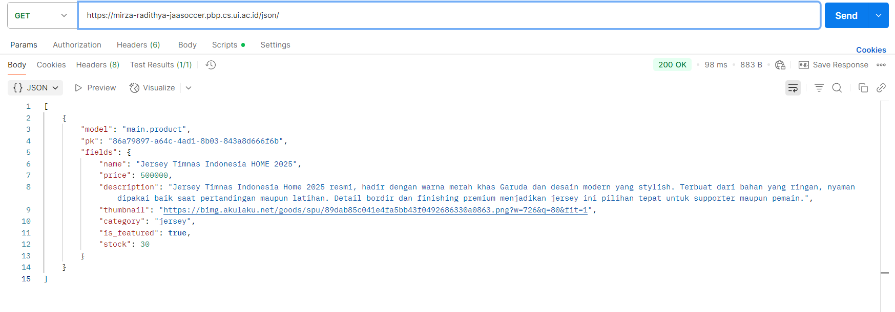
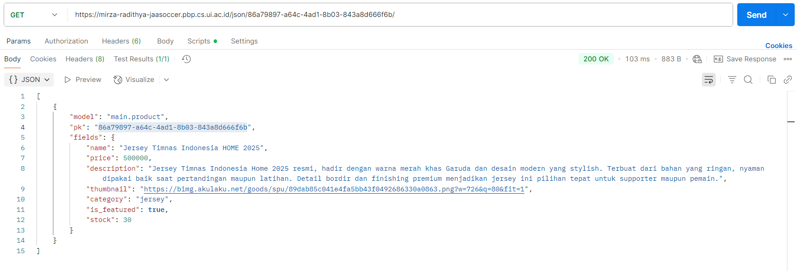
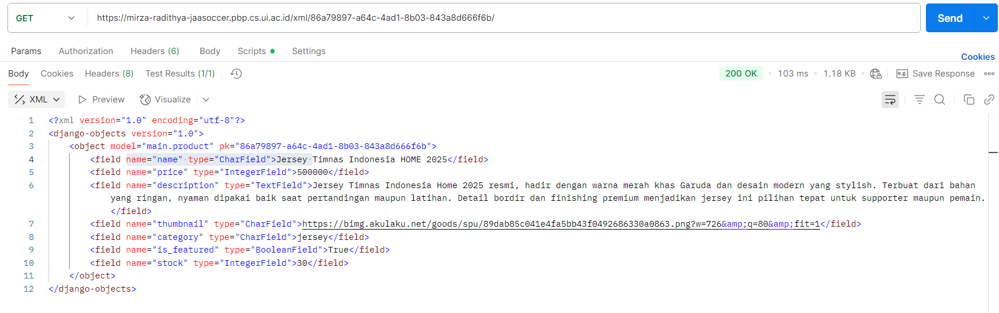

Nama            : Mirza Radithya Ramadhana
NPM             : 2406405563
Kelas           : PBP B
Tautan PWS      : https://mirza-radithya-jaasoccer.pbp.cs.ui.ac.id/
Tautan GitHub   : https://github.com/JaaTzy14/jaa-soccer

Tugas 5
1. Jika terdapat beberapa CSS selector untuk suatu elemen HTML, jelaskan urutan prioritas pengambilan CSS selector tersebut! 
&emsp;1. Inline Style (style="") 
&emsp;2. ID Selector (#id) 
&emsp;3. Class, Attribute, Pseudo-class (.class, [type="text"], :hover) 
&emsp;4. Element, Pseudo-element (div, ::before) 
&emsp;Tambahan:
&emsp;- Elemen yang memiliki tag !important akan didahulukan
&emsp;- Jika tie, maka akan diambil yang paling terakhir

2. Mengapa responsive design menjadi konsep yang penting dalam pengembangan aplikasi web? Berikan contoh aplikasi yang sudah dan belum menerapkan responsive design, serta jelaskan mengapa! 
&emsp;Responsive design penting agar pengguna yang mengakses dari berbagai ukuran device, dapat mengakses web dengan nyaman. Contoh aplikasi yang sudah menerapkan responsive design adalah youtube. Ketika kita mengakses youtube dari layar yang besar dan layar yang kecil, tampilannya akan berbeda menyesuaikan ukuran layar. Contoh aplikasi yang belum responsive adalah https://dequeuniversity.com/library/responsive/1-non-responsive dimana ketika kita buka dari layar yang kecil, tampilannya akan terpotong-potong. 

3. Jelaskan perbedaan antara margin, border, dan padding, serta cara untuk mengimplementasikan ketiga hal tersebut! 
&emsp;Margin adalah jarak dari suatu elemen ke elemen lain. Border adalah garis pembatas pada elemen. Padding adalah jarak antara konten dalam elemen dan border. Untuk mengimplementasikannya, kita cukup membuat css dengan isi 
&emsp;div { 
&emsp;&emsp;margin: 10px; 
&emsp;&emsp;border: 2px solid black; 
&emsp;&emsp;padding: 5px; 
&emsp;} 
dimana margin akan diset sejauh 10px, border setebal 2px dengan model solid dan warna hitam, serta padding sejauh 5px. 

4. Jelaskan konsep flex box dan grid layout beserta kegunaannya! 
&emsp;1. Flexbox 
&emsp;&emsp;Flexbox adalah cara mengatur elemen pada html agar sejajar dalam satu baris/kolom. Flexbox dapat berguna untuk membuat menu horizontal/vertikal. Kita juga bisa mengatur jarak antar elemennya. Elemen juga bisa dipusatkan, disejajarkan, atau disebarkan. 
&emsp;2. Grid 
&emsp;&emsp;Grid adalah cara mengatur elemen pada html agar dapat berbentuk seperti layout 2 dimensi dengan baris dan kolom. Kita bisa membuat layout kompleks menggunakan grid. Ukuran masing2 kolom dan baris juga dapat diatur. Grid juga mempunyai fitur auto-fit dan auto-fill yang membuat design lebih responsive. 

5. Jelaskan bagaimana cara kamu mengimplementasikan checklist di atas secara step-by-step (bukan hanya sekadar mengikuti tutorial)!
    - Implementasikan fungsi untuk menghapus dan mengedit product. 
    &emsp;Saya menambahkan fungsi delete_product dan edit_product pada views.py. Saya juga melakukan routing terhadap dua fungsi tersebut di urls.py. Saya juga membuat html bernama edit_product.html untuk halaman edit product. 

    - Kustomisasi desain pada template HTML yang telah dibuat pada tugas-tugas sebelumnya menggunakan CSS atau CSS framework 
    &emsp;Saya mengimpor css tailwind ke base.html dan juga saya membuat file css bernama global.css agar semua file html menerapkan styling dari situ. Pada halaman login, register, tambah product, dan edit product, saya hanya mengubah warna dari tutorial. Pada halaman product, saya menambahkan beberapa filter untuk barang seperti sepatu dan jersey. Saya juga membuat html baru bernama card_product.html untuk menampilkan produk pada halaman daftar product. Saya mengedit beberapa tombol dari tutorial dan warnanya. Saya juga membuat agar card menampilkan tombol edit/delete ketika user yang sedang login adalah user yang membuat product tersebut. Saya juga membuat html baru bernama navbar.html untuk menampilkan navigasi pada halaman daftar product dan tambah product. Saya membuat navigasinya responsive, jadi ketika user mengakses dari layar yang kecil, navigasi akan berubah menjadi tombol hamburger. 

Tugas 4
1. Apa itu Django AuthenticationForm? Jelaskan juga kelebihan dan kekurangannya.
    Django AuthenticationForm adalah form yang dibuat oleh django untuk menangani proses login pengguna. Kelebihan dari form ini adalah kita tidak harus membuat form login dari awal, keamanan yang terjamin dengan csrf token, sudah otomatis sync dengan backend pada Django, dan sudah otomati memvalidasi input dari client. Kekurangannya adalah tampilan yang terlalu sederhana serta hanya mendukung metode login dengan username dan password.

2. Apa perbedaan antara autentikasi dan otorisasi? Bagaiamana Django mengimplementasikan kedua konsep tersebut?
    autentikasi adalah proses memverifikasi identitas pengguna, sedangkan otorisasi adalah proses menentukan apa yang dapat pengguna tersebut lakukan. Untuk melakukan autentikasi, Django menyediakan model User, fungsi login/logout, serta form untuk login (AuthenticationForm). Untuk melakukan otorisasi, Django punya sistem permission dan group yang bisa dikasih ke model User untuk menentukan apa yang bisa dilakukan user tersebut.

3. Apa saja kelebihan dan kekurangan session dan cookies dalam konteks menyimpan state di aplikasi web?
    Cookies dapat menyimpan data state pada browser client, tetapi memiliki keterbatasan ukuran dan resiko keamanan karena datanya dapat diubah oleh pengguna. Sementara itu, session menyimpan data state pada server sehingga lebih aman dan dapat berukuran lebih besar, tetapi membutuhkan sumber daya server yang memadai.

4. Apakah penggunaan cookies aman secara default dalam pengembangan web, atau apakah ada risiko potensial yang harus diwaspadai? Bagaimana Django menangani hal tersebut?
    Penggunaan cookies tidak sepenuhnya aman. Terdapat serangan-serangan seperti CSRF, XSS, dan pencurian data melalui koneksi yang tidak terencrypt. Untuk menangani hal tersebut, Django menyediakan CSRF token untuk memastikan data dikirim oleh pengguna asli, dukungan secure agar cookie hanya terkirim melalui HTTPS, dan pengaturan atribut HttpOnly agar cookie tidak bisa diakses oleh JavaScript.

5. Jelaskan bagaimana cara kamu mengimplementasikan checklist di atas secara step-by-step (bukan hanya sekadar mengikuti tutorial).
    - Checklist 1: Mengimplementasikan fungsi registrasi, login, dan logout untuk memungkinkan pengguna mengakses aplikasi sebelumnya sesuai dengan status login/logoutnya.
        Saya membuat fungsi register,login_user, dan logout_user pada file views.py menggunakan form bawaan Django. Setelah itu, saya melakukan routing terhadap ketiga fungsi tersebut pada urls.py. Saya juga membuat file html baru  bernama register.html untuk menampilkan menu register dan login.html untuk menampilkan menu login. Saya juga membuat fungsi show_main dan show_product agar hanya dapat diakses oleh user yang sudah login dengan menambahkan property @login_required pada kedua fungsi tersebut.

    - Checklist 2: Membuat dua (2) akun pengguna dengan masing-masing tiga (3) dummy data menggunakan model yang telah dibuat sebelumnya untuk setiap akun di lokal.
        Saya buat dua akun dan menambahkan 3 dummy data pada masing-masing akun.
    
    - Checklist 3: Menghubungkan model Product dengan User.
        Saya menambahkan field User pada model Product, sehingga product yang dibuat memiliki field User yang berisi user yang membuat produk tersebut.
    
    - Checklist 4: Menampilkan detail informasi pengguna yang sedang logged in seperti username dan menerapkan cookies seperti last_login pada halaman utama aplikasi.
        Saya menaruh request.user pada context di show_main, sehingga ketika user mengakses main, request.user akan dipassing ke fungsi render bersamaan dengan context. Saya juga menaruh request.COOKIES.get('last_login', 'Never') untuk mempassing data last login dari cookies. Jika data last login tidak ada maka string 'never' akan dipassing. cookies last_login saya set pada fungsi login_user dan akan di delete pada fungsi logout_user. Untuk menampilkan datanya pada halaman utama, saya mengedit main.html dan menambahkan tag Django seperti {{ last_login }} untuk menampilkan informasi last_login.

Tugas 3
1. Jelaskan mengapa kita memerlukan data delivery dalam pengimplementasian sebuah platform?
    Data delivery penting agar kita bisa mengirimkan data pada database di server kepada client yang ingin mengakses data tersebut. Tanpa data delivery, semua data yang ada di data base .tidak bisa dimanfaatkan oleh client.

2. Menurutmu, mana yang lebih baik antara XML dan JSON? Mengapa JSON lebih populer dibandingkan XML?
    Menurut saya, JSON lebih baik dari pada XML. Saya lebih menyukai JSON karena ukuran file JSON yang cenderung lebih kecil daripada XML. Selain itu, menurut saya file JSON lebih mudah dibaca dinandingkan dengan XML. JSON juga lebih cepat diproses oleh mesin karena formatnya yang sudaah didesain untuk struktur data di banyak bahasa pemrograman, khususnya JavaScript. Hal-hal tersebut juga merupakan alasan mengapa JSON lebih populer dibandingkan XML.

3. Jelaskan fungsi dari method is_valid() pada form Django dan mengapa kita membutuhkan method tersebut?
    Fungsi tersebut akan mengecek apakah form yang diisi sudah sesuai dengan aturan yang ditentukan, seperti tipe data ataupun panjang maksimal..Jika data yang diisi pada form tidak sesuai, maka fungsi tersebut akan mereturn False. Jika data yang diisi sudah sesuai, maka fungsi akan mereturn nilai True. Jadi, kita membutuhkan method tersebut agar kita bisa memastikan bahwa form yang diisi oleh client sudah sesuai dengan aturan yang kita buat sebelum diproses ke database.

4. Mengapa kita membutuhkan csrf_token saat membuat form di Django? Apa yang dapat terjadi jika kita tidak menambahkan csrf_token pada form Django? Bagaimana hal tersebut dapat dimanfaatkan oleh penyerang?
    Kita membutuhkan csrf_token di django agar web kita terlindungi dari Cross-Site Request Forgery. Jika kita tidak menggunakan csrf_token, maka web kita rentan untuk terkena Cross-Site Request Forgery. Cross-Site Request Forgery adalah penyerangan dimana website penyerang akan memanfaatkan celah untuk berpura-pura menjadi suatu client untuk melakukan tindakan-tindakan yang seharusnya tidak bisa dilakukan oleh penyerang. csrf_token dapat mencegah penyerang melakukan itu karena token itu akan menjadi identitas unik untuk memastikan bahwa permintaan berasal langsung dari client.

5. Jelaskan bagaimana cara kamu mengimplementasikan checklist di atas secara step-by-step (bukan hanya sekadar mengikuti tutorial).
    - Checklist 1: Tambahkan 4 fungsi views baru untuk melihat objek yang sudah ditambahkan dalam format XML, JSON, XML by ID, dan JSON by ID.
        Saya membuat empat buah fungsi, yaitu show_json, show_xml, show_json_by_id, dan show_xml_by_id. Pada fungsi show_json dan show_xml saya mengambil semua data pada database dan menggunakan serializers untuk mengubah data tersebut ke format JSON atau XML. Setelah itu, saya mereturn httpResponse pada kedua fungsi tersebut agar bisa menampilkan data JSON atau XML nya ke client. Pada fungsi show_json_by_id dan show_xml_by_id, saya melakukan hal yang sama, tetapi saya menambahkan parameter id pada kedua fungsi tersebut dan mengambil data pada database berdasarkan id object. Jika objek tidak ditemukan, fungsi akan mereturn 404 not found.
    - Checklist 2: Membuat routing URL untuk masing-masing views yang telah ditambahkan pada poin 1.
        Saya mengimpor semua fungsi yang sudah saya buat pada checklist 1 ke urls.py dan saya menambahkan konfigurasi URL dengan menggunakan path() ke fungsi yang sesuai serta memberi nama-nama yang sesuai, seperti path('json<str:id>', show_json_by_id, name='show_json_by_id'). Dengan begitu, setiap alamat URL dipetakan ke fungssi views yang sesuai sehingga client bisa mengakses dengan mudah.
    - Checklist 3: Membuat halaman yang menampilkan data objek model yang memiliki tombol "Add" yang akan redirect ke halaman form, serta tombol "Detail" pada setiap data objek model yang akan menampilkan halaman detail objek.
        Saya membuat fungsi create_product dan show_product pada views.py. Setelah itu saya melakukan routing terhadap fungsi tersebut pada urls.py. Setelah itu, saya memodifikasi main.html agar bisa menampilkan button "Add" yang menuju ke fungsi create_product dan button "Detail" yang menuju ke fungsi show_product. Saya menambahkan parameter id pada fungsi show_product agar fungsi bisa mengambil objek model berdasarkan id yang direquest oleh client.
    - Checklist 4: Membuat halaman form untuk menambahkan objek model pada app sebelumnya.
        Saya membuat file create_product.html yang terhubung dengan fungsi create_product pada views.py. Saya memodifikasi HTML nya agar bisa membentuk form yang nantinya dapat dikirimkan untuk membuat objek model.
    - Checklist 5: Membuat halaman yang menampilkan detail dari setiap data objek model.
        Saya membuat file product_detail.html yang terhubung dengan fungsi show_product pada views.py. Saya memodifikasi HTML nya agar bisa menampilkan setaip detail yang dimiliki oleh objek modek yang direquest oleh client.

6. Apakah ada feedback untuk asdos di tutorial 2 yang sudah kalian kerjakan?
    Tidak ada.

7. SS Postman

Tugas 2
1. Jelaskan bagaimana cara kamu mengimplementasikan checklist di atas secara step-by-step (bukan hanya sekadar mengikuti tutorial).
    - Checklist 1: Membuat sebuah proyek Django baru.
        Saya membuat folder baru bernama jaa-soccer yang berfungsi sebagai direktori utama. Pada direktori tersebut, saya menginisialisasi virtual environment, membuat file requirements.txt yang berisi dependencies, lalu menginstall seluruh dependencies tersebut. Setelah itu, saya menginisiasi proyek django dengan nama jaa_soccer. Selanjutnya, saya membuat file .env untuk development dan file .env.prod untuk production yang berisi konfigurasi enviroment variables. Terakhir, saya menyesuaikan settings.py agar membaca variabel tersebut, menambahkan ALLOWED_HOSTS, dan mengatur database agar otomatis memakai SQLite saat development serta PostgreSQL saat production.
    - Checklist 2: Membuat aplikasi dengan nama main pada proyek tersebut.
        Saya menjalankan perintah "python manage.py startapp main" untuk membuat aplikasi dengan nama main. Selanjutnya, saya mendaftarkan aplikasi tersebut ke daftar aplikasi pada file settings.py. Terakhir, saya membuat direktori templates pada direktori aplikasi main, membuat file main.html, lalu menulis beberapa kode singkat pada html tersebut.
    - Checklist 3: Melakukan routing pada proyek agar dapat menjalankan aplikasi main.
        Saya melakukan routing dengan cara menambahkan "path('', include('main.urls'))" pada daftar urlpatterns di file urls.py direktori proyek sehingga aplikasi main dapat diakses.
    - Checklist 4: Membuat model pada aplikasi main dengan nama Product dan beberapa atribut.
        Saya membuat model product dengan menambahkan class product pada models.py di direktori main. Saya juga menambahkan beberapa atribut, seperti name dan price, dengan tipe datanya masing-masing. Setelah itu, saya melakukan membuat dan mengaplikasikan migrasi model agar perubahan pada models.py terefleksikan dalam database.
    - Checklist 5: Membuat sebuah fungsi pada views.py untuk dikembalikan ke dalam sebuah template HTML yang menampilkan nama aplikasi serta nama dan kelas kamu.
        Saya mendefinisikan fungsi show_main pada views.py. Setelah itu, saya menambahkan context yang berisi nama aplikasi, nama saya, npm saya, dan kelas saya. Fungsi tersebut akan mereturn render ke template main.html dengan membawa data context sehingga informasi dapat ditampilkan pada HTML.
    - Checklist 6: Membuat sebuah routing pada urls.py aplikasi main untuk memetakan fungsi yang telah dibuat pada views.py.
        Saya mengimpor fungsi show_main dari views.py pada direkroti app main, mendefinisikan app_name untuk penamaan routing, lalu menambahkan "path('', show_main, name='show_main')" agar ketika aplikasi diakses melalui URL utama, fungsi show_main yang telah dibuat akan dipanggil dan menampilkan halaman sesuai template.
    - Checklist 7: Melakukan deployment ke PWS terhadap aplikasi yang sudah dibuat.
        Saya membuat proyek baru di PWS dengan nama jaasoccer, menyimpan credentials, lalu menyalin konfigurasi dari .env.prod ke tab Environs. Setelah itu, saya menambahkan URL deployment ke ALLOWED_HOSTS pada settings.py, melakukan git add, commit, dan push, kemudian menjalankan perintah Project Command dan memasukkan credentials yang telah disimpan untuk melakukan deployment.

2. Buatlah bagan yang berisi request client ke web aplikasi berbasis Django beserta responnya dan jelaskan pada bagan tersebut kaitan antara urls.py, views.py, models.py, dan berkas html.
    URL: https://www.ibmmainframer.com/static/django/images/MVT_req_resp.png
    Ketika seorang pengguna ingin mengakses server Django, request akan masuk ke urls.py. File itu akan mencocokkan alamat URL yang diminta dengan route yang sudah ada. Jika ditemukan routenya, Django akan meneruskan request ke fungsi yang ada di views.py. Di dalam view, fungsi akan dijalankan. Fungsi tersebut bisa sekadar menyiapkan data, atau berinteraksi dengan models.py untuk membaca maupun menulis ke database. Data yang didapat kemudian diproses dan dikirimkan ke template HTML agar ditampilkan dalam bentuk halaman web yang bisa dilihat oleh pengguna. Setelah itu, server mengirim respons HTML tersebut kembali ke browser, sehingga pengguna bisa melihat hasilnya.

3. Jelaskan peran settings.py dalam proyek Django!
    File settings.py berfungsi untuk mengatur konfigurasi dari suatu proyek, seperti daftar aplikasi, host, dan database. Dengan kata lain, file tersebut menjadi tempat utama untuk mengatur mekanisme proyek sesuai agar sesuai dengan kebutuhan.

4. Bagaimana cara kerja migrasi database di Django?
    Migrasi pada Django berfungsi untuk menjaga struktur data base sinkron dengan model yang dibuat pada models.py. Ketika kita menambah atau mengubah model,kita harus menjalankan makemigrations untuk membuat file migrasi yang berisi instruksi perubahan model, lalu menjalankan migrate untuk menerapkan perubahan tersebut ke dalam data base.

5. Menurut Anda, dari semua framework yang ada, mengapa framework Django dijadikan permulaan pembelajaran pengembangan perangkat lunak?
    Menurut saya, ada beberapa alasan mengapa framework django sering dijadikan pembelajaran. Pertama, Django bisa digunakan secara cross-platform. Kedua, Django dibuat menggunakan python sehingga ramah bagi pemula. Ketiga, Django memiliki dokumentasi yang lengkap sehingga dapat memudahkan pengembang. Keempat, Django menyediakan ORM yang membuat pengembang dapat dengan mudah mentransfer data dari database menjadi sebuah objek. Terakhir, Django menyediakan salah satu security terbaik.

6. Apakah ada feedback untuk asisten dosen tutorial 1 yang telah kamu kerjakan sebelumnya?
    Tidak ada, sudah baik.
